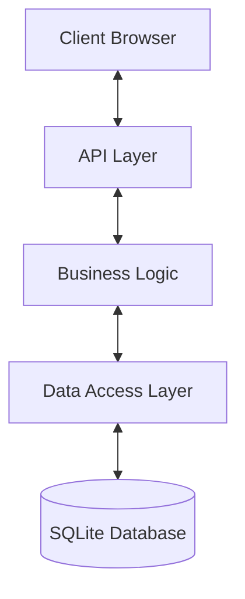
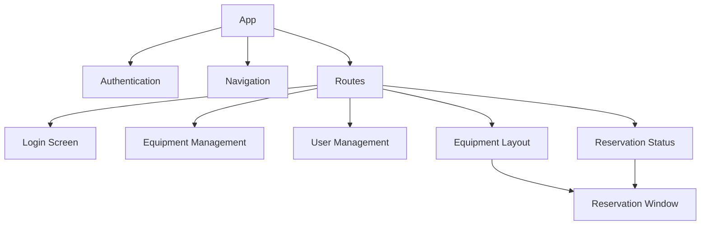
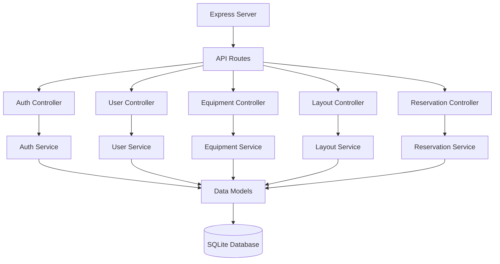
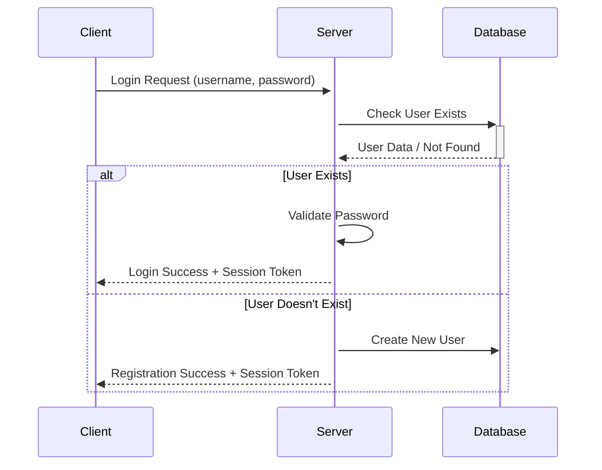
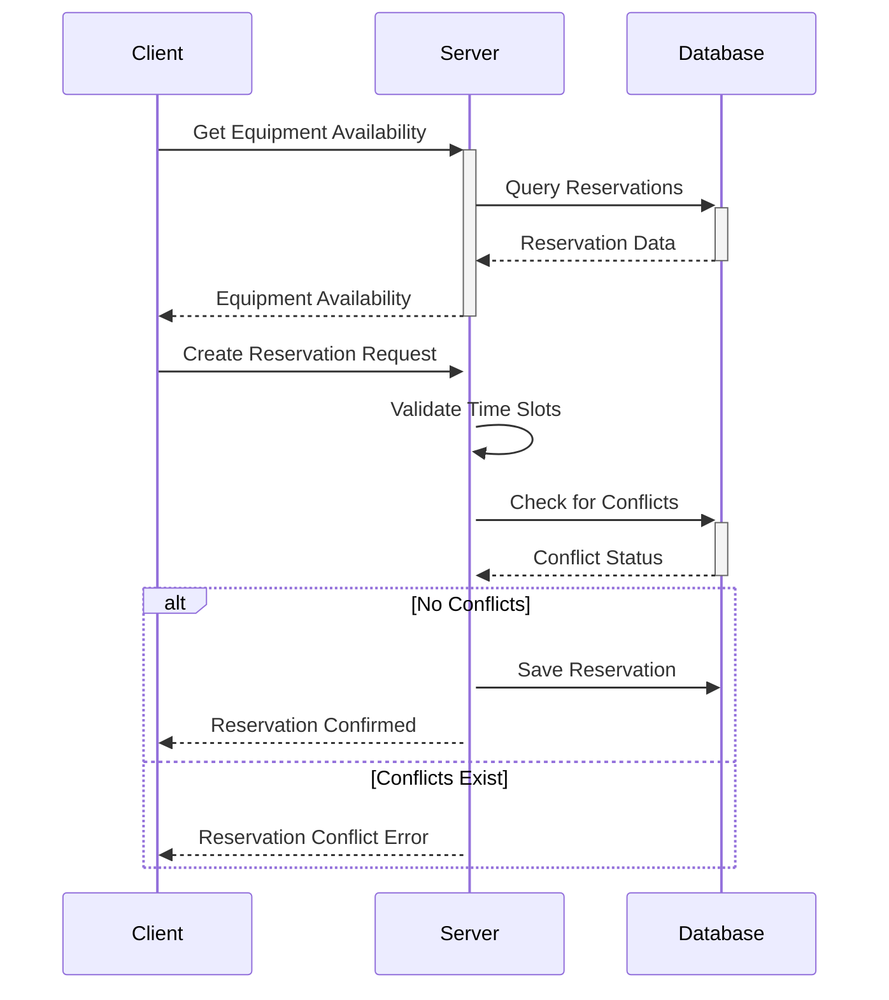
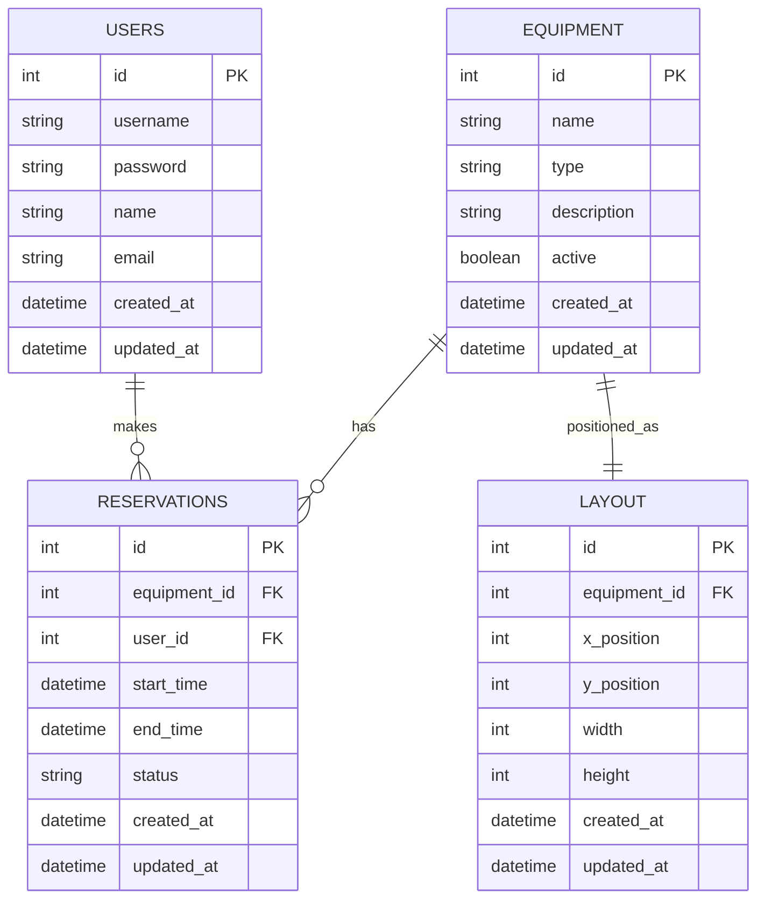

# System Patterns: NcReserve

## System Architecture Overview

NcReserve follows a modern web application architecture with clear separation of concerns:

### Client-Side Architecture
The frontend is built using React with a component-based architecture. The application uses a single-page application (SPA) approach to provide a seamless user experience.

### Server-Side Architecture
The backend is built using Node.js and Express, providing RESTful API endpoints for the frontend to consume. The server handles authentication, data validation, business logic, and database operations.

### Data Storage
SQLite is used as the database for simplicity and portability. The database schema is designed to efficiently store and retrieve user, equipment, and reservation data.

## Component Structure

### Frontend Components

#### Core Components
1. **App**: The root component that manages application state and routing
2. **Authentication**: Handles user login and session management
3. **Navigation**: Provides navigation between different screens
4. **Routes**: Manages routing to different screens

#### Screen Components
1. **Login Screen**: User authentication interface
2. **Equipment Management**: CRUD interface for equipment
3. **User Management**: CRUD interface for users
4. **Equipment Layout**: Visual representation of equipment placement
5. **Reservation Status**: Overview of all equipment reservations
6. **Reservation Window**: Detailed reservation interface for specific equipment

### Backend Components

#### API Routes
1. **/api/auth**: Authentication endpoints
2. **/api/users**: User management endpoints
3. **/api/equipment**: Equipment management endpoints
4. **/api/layout**: Equipment layout endpoints
5. **/api/reservations**: Reservation management endpoints

#### Controllers
Controllers handle HTTP requests and responses, validating input and formatting output.

#### Services
Services contain the business logic, performing operations on the data and enforcing business rules.

#### Models
Models define the data structure and provide an interface to the database.

## Data Flow Diagrams

### Authentication Flow

### Reservation Flow

## State Management Approach

### Frontend State Management
The application uses React's Context API for global state management, with local component state for UI-specific state. The global state includes:

1. **Authentication State**: Current user and login status
2. **Equipment State**: List of equipment and their details
3. **Layout State**: Equipment placement information
4. **Reservation State**: Current reservations and availability

### Backend State Management
The server is stateless, with all state stored in the database. Session information is managed through authentication tokens.

## Design Patterns

### Frontend Patterns

#### Component Patterns
- **Container/Presentational Pattern**: Separating logic from presentation
- **Compound Components**: Building complex UI elements from simpler components
- **Render Props**: Sharing code between components

#### State Management Patterns
- **Context Provider Pattern**: Providing global state to component tree
- **Reducer Pattern**: Managing complex state transitions
- **Custom Hooks**: Encapsulating and reusing stateful logic

### Backend Patterns

#### Architectural Patterns
- **MVC Pattern**: Separating concerns into Model, View, and Controller
- **Repository Pattern**: Abstracting data access logic
- **Service Layer Pattern**: Encapsulating business logic

#### API Patterns
- **RESTful API**: Resource-based API design
- **Middleware Pattern**: Processing requests through a chain of handlers
- **Error Handler Pattern**: Centralizing error handling logic

## API Structure

### Authentication API
- `POST /api/auth/login`: Authenticate user
- `POST /api/auth/logout`: End user session
- `GET /api/auth/me`: Get current user information

### User API
- `GET /api/users`: List all users
- `GET /api/users/:id`: Get user details
- `POST /api/users`: Create new user
- `PUT /api/users/:id`: Update user
- `DELETE /api/users/:id`: Delete user

### Equipment API
- `GET /api/equipment`: List all equipment
- `GET /api/equipment/:id`: Get equipment details
- `POST /api/equipment`: Create new equipment
- `PUT /api/equipment/:id`: Update equipment
- `DELETE /api/equipment/:id`: Delete equipment

### Layout API
- `GET /api/layout`: Get equipment layout
- `POST /api/layout`: Save equipment layout
- `PUT /api/layout/equipment/:id`: Update equipment position

### Reservation API
- `GET /api/reservations`: List all reservations
- `GET /api/reservations/equipment/:id`: Get reservations for specific equipment
- `GET /api/reservations/user/:id`: Get reservations for specific user
- `POST /api/reservations`: Create new reservation
- `PUT /api/reservations/:id`: Update reservation
- `DELETE /api/reservations/:id`: Cancel reservation

## Database Schema

## Security Considerations

### Authentication
- Password hashing using bcrypt
- Session-based authentication with secure cookies
- CSRF protection

### Data Validation
- Input validation on all API endpoints
- Sanitization of user input
- Parameterized queries to prevent SQL injection

### Authorization
- Role-based access control for administrative functions
- Validation of user permissions for each operation
- Protection of sensitive routes
